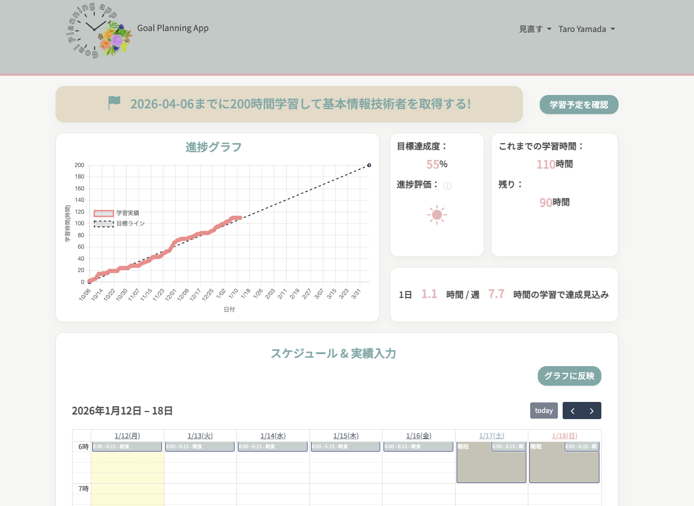
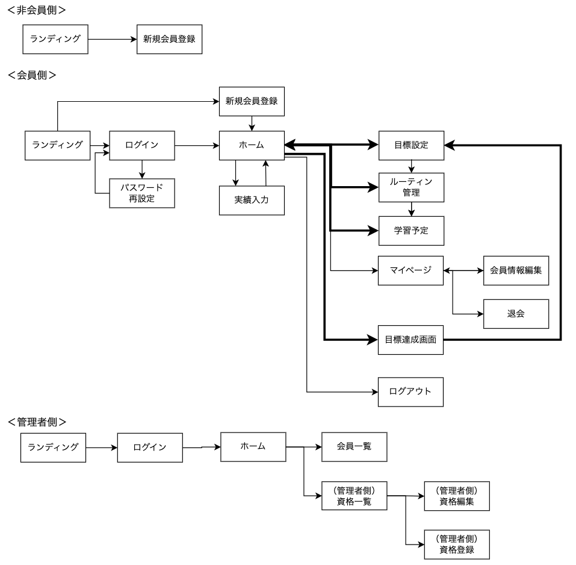
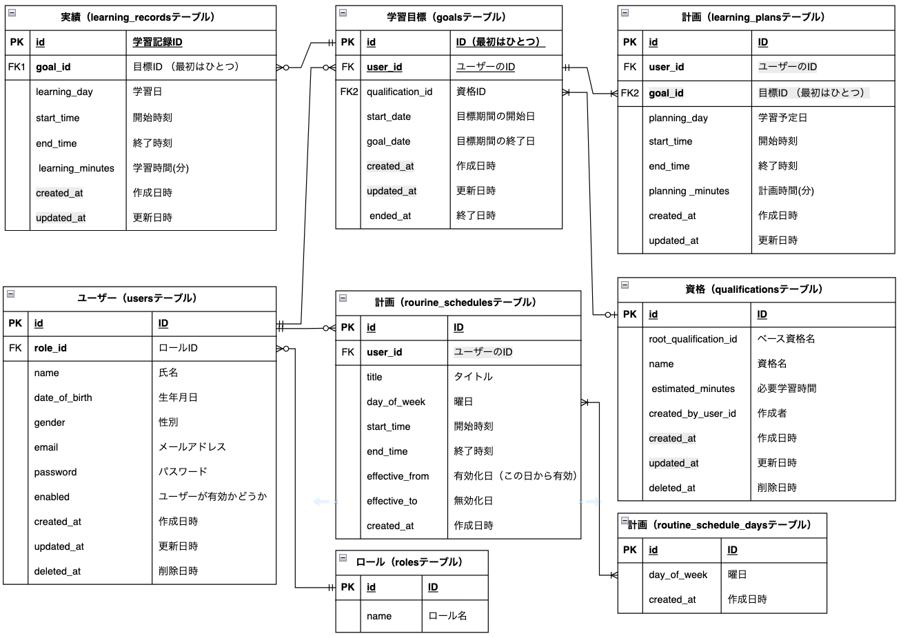

# Goal Planning App

Goal Planning App は、急な予定変更が多い育児・介護中の方や働く社会人が、  
資格取得に向けた学習を無理なく、見通しを立てながら学習を継続するための学習管理アプリです。

## アプリ概要

学習目標を起点に、計画と実績を一元管理することで、  
現在の進捗状況を把握しやすくし、学習継続を支援します。

---

## 課題と解決アプローチ

### 課題
- 資格取得に必要な学習時間を見積もっても、急な予定変更で計画が崩れやすい
- 目標日までに学習が間に合うのかを確認するのに手間がかかり、モチベーションが低下しやすい

### 解決方法
- 実際の学習時間を記録し、学習計画と実績を紐づけて管理
- 学習実績に応じて、目標達成までに必要な学習量を再計算
- 学習目標を起点に、現在の進捗状況を可視化

---

## 本アプリの特徴
- 学習実績を入力すると、目標達成に必要な学習時間の目安を随時確認できる
- 目標 → 計画 → 実績を一貫して管理できる設計
- 学習状況を可視化することで、学習継続のモチベーション維持を支援

---

## 想定ユーザー
- 資格取得に向けて学習時間を確保したい育児・介護中の方
- 仕事や家庭と両立しながら学習を進めたい社会人

---

## 主な機能
- ユーザー登録・ログイン機能
- 学習目標の設定（同時に1つの目標のみ有効）
- 学習計画の登録・編集
- 学習実績の登録・編集
- 学習進捗の可視化
- 管理者による会員管理・資格情報管理  

※ 達成済み目標の履歴閲覧機能、スケジュール管理機能は今後実装予定です。

---

## 画面遷移図

ログイン後はホーム画面を起点に、  
学習実績の登録・編集を行い、目標管理・学習予定・実績入力などの主要機能に遷移します。  
管理者は会員管理および資格情報の管理を行います。

※ 過去の達成履歴一覧ページ、予定管理ページは今後実装予定です。

---

## ER図

- 学習目標を中心に、学習計画および学習実績を紐づけることで進捗管理を行う構成としています。
- 学習目標は履歴管理を前提とした設計とし、達成済み目標の閲覧機能は今後実装予定です。

※ 本 ER 図は README 用に主要エンティティのみを抜粋した簡易構成です。  
　 実装では曜日管理などを正規化して管理しています。

---

## 使用技術
- バックエンド：Java / Spring Boot
- フロントエンド：HTML / CSS / JavaScript / Thymeleaf / Bootstrap
- データベース：MySQL
- 認証：Spring Security
- インフラ：Render
- ライブラリ：Chart.js（学習実績の可視化）、FullCalendar（学習予定表示）

---

### 工夫した点
- 学習目標を起点に、計画と実績を一元管理できる構成としました
- 同時に1つの目標のみ有効とすることで、学習の集中度を高める設計としています
- 目標や計画、ルーティンを更新できるようにすることで、途中での方向転換も可能にしました

### 今後の課題
- 達成済み学習目標の履歴閲覧機能の実装
- スケジュール連携（Google カレンダーなどの外部 API）
- Service 層を中心とした単体テストの実装
